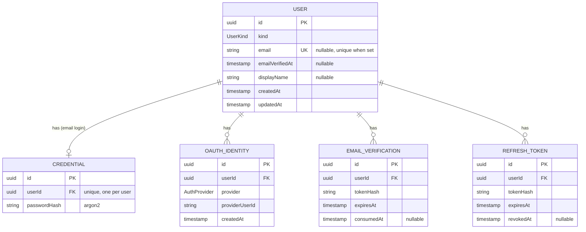
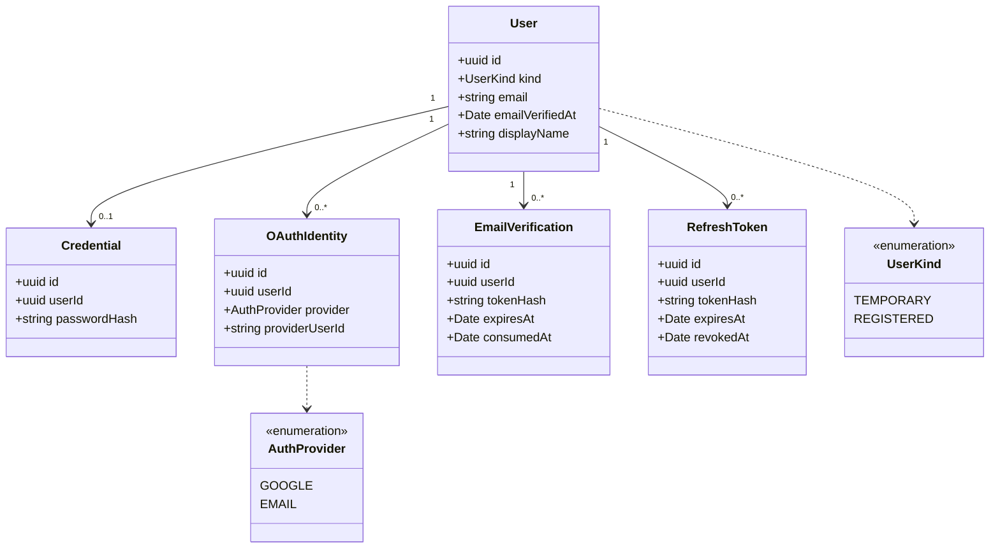

# Auth service data model

Entity relationship and class diagrams for `luna-shopper-backend-auth`, the identity provider. This
service owns its own database and is the only place identity data lives. Source of truth for the
model is plan `0005-auth-service.md`; these diagrams are generated from it and should be updated
alongside the entities once they are coded.

Users in other services are referenced only by the opaque `userId` this service mints; no other
service reads this database.

## ER diagram

Constraints of note: `OAUTH_IDENTITY` is unique on (`provider`, `providerUserId`); `CREDENTIAL`
is unique on `userId` (at most one email password credential per user).

## Class diagram

## Notes

- `User.kind` distinguishes a `TEMPORARY` account (device token only) from a `REGISTERED` one
  (email or Google). The temp to account upgrade flips `kind` in place, keeping the same `id`.
- Access tokens are signed JWTs verified offline by other services; only refresh tokens are
  stored here (`REFRESH_TOKEN`, rotated on use).
- All enums are defined as constants and mirrored into `@portfolio/luna-shopper/contracts` where
  a value crosses a service boundary.
