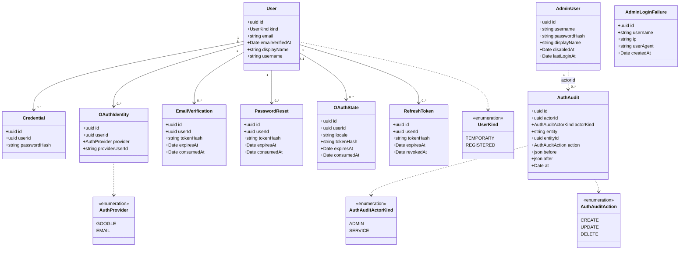

# Auth service data model

Entity relationship and class diagrams for `luna-shopper-backend-auth`, the identity provider. This
service owns its own Postgres database and is the only place identity data lives. The TypeORM
entities in `src/app/entities` are the source of truth, and the migrations in
`src/app/db/migrations` create the schema (`synchronize` is never used). Plan `0005-auth-service.md`
describes the first model, and later plans (0018, 0022, 0023, 0071, 0077) added to it.

Other services refer to a user only by the opaque `userId` this service mints, and no other service
reads this database. The same is true of an operator: `core_audit.actorId` in core and
`catalog_audit.actorId` in catalog hold an `admin_users.id` from this database, with no foreign key.

## ER diagram

Every table except `auth_audit` extends `BaseEntity`, which gives it a `uuid` primary key
(`gen_random_uuid()`) plus `createdAt` and `updatedAt` (`timestamptz`). The diagram shows those
columns on each table. Solid lines are foreign keys. Dotted lines are references by value with no
foreign key.

```mermaid
erDiagram
    USER ||--o| CREDENTIAL : "has (email login)"
    USER ||--o{ OAUTH_IDENTITY : "has"
    USER ||--o{ EMAIL_VERIFICATION : "has"
    USER ||--o{ PASSWORD_RESET : "has"
    USER |o--o{ OAUTH_STATE : "links onto (optional)"
    USER ||--o{ REFRESH_TOKEN : "has"
    ADMIN_USER ||..o{ AUTH_AUDIT : "actorId, no FK"
    ADMIN_USER |o..o{ ADMIN_LOGIN_FAILURE : "username, no FK"

    USER {
        uuid id PK "table users"
        timestamptz createdAt
        timestamptz updatedAt
        user_kind kind "UserKind"
        varchar email UK "nullable, unique when set (partial index)"
        timestamptz emailVerifiedAt "nullable"
        varchar displayName "nullable, as the identity provider supplied it"
        varchar username "not unique, indexed ix_users_username"
    }
    CREDENTIAL {
        uuid id PK "table credentials"
        timestamptz createdAt
        timestamptz updatedAt
        uuid userId FK, UK "one per user, ON DELETE CASCADE"
        varchar passwordHash "argon2"
    }
    OAUTH_IDENTITY {
        uuid id PK "table oauth_identities"
        timestamptz createdAt
        timestamptz updatedAt
        uuid userId FK "ON DELETE CASCADE"
        auth_provider provider "AuthProvider, unique with providerUserId"
        varchar providerUserId
    }
    EMAIL_VERIFICATION {
        uuid id PK "table email_verifications"
        timestamptz createdAt
        timestamptz updatedAt
        uuid userId FK "ON DELETE CASCADE"
        varchar tokenHash UK
        timestamptz expiresAt
        timestamptz consumedAt "nullable"
    }
    PASSWORD_RESET {
        uuid id PK "table password_resets"
        timestamptz createdAt
        timestamptz updatedAt
        uuid userId FK "ON DELETE CASCADE"
        varchar tokenHash UK
        timestamptz expiresAt
        timestamptz consumedAt "nullable"
    }
    OAUTH_STATE {
        uuid id PK "table oauth_states"
        timestamptz createdAt
        timestamptz updatedAt
        uuid userId FK "nullable, ON DELETE CASCADE"
        varchar locale "nullable"
        varchar tokenHash UK
        timestamptz expiresAt
        timestamptz consumedAt "nullable"
    }
    REFRESH_TOKEN {
        uuid id PK "table refresh_tokens"
        timestamptz createdAt
        timestamptz updatedAt
        uuid userId FK "ON DELETE CASCADE"
        varchar tokenHash UK
        timestamptz expiresAt
        timestamptz revokedAt "nullable"
    }
    ADMIN_USER {
        uuid id PK "table admin_users"
        timestamptz createdAt
        timestamptz updatedAt
        varchar username UK
        varchar passwordHash "argon2"
        varchar displayName "nullable"
        timestamptz disabledAt "nullable"
        timestamptz lastLoginAt "nullable"
    }
    ADMIN_LOGIN_FAILURE {
        uuid id PK "table admin_login_failures"
        timestamptz createdAt "the attempt time"
        timestamptz updatedAt
        varchar username "as typed, indexed with createdAt"
        varchar ip "nullable"
        varchar userAgent "nullable, varchar(512)"
    }
    AUTH_AUDIT {
        uuid id PK "table auth_audit, no BaseEntity"
        uuid actorId "an admin_users.id, no FK"
        auth_audit_actor_kind actorKind "AuthAuditActorKind"
        varchar entity "table name of the changed row"
        uuid entityId "indexed with entity"
        auth_audit_action action "AuthAuditAction"
        jsonb before "nullable, changed fields only"
        jsonb after "nullable, changed fields only"
        timestamptz at "indexed ix_auth_audit_at"
    }
```

Constraints of note:

- `users.email` is unique only when it is set (`uq_users_email ... WHERE email IS NOT NULL`).
  `users.username` has a plain index (`ix_users_username`) and is not unique.
- `credentials` is unique on `userId` (`uq_credentials_user`), so a user has at most one email
  password credential.
- `oauth_identities` is unique on (`provider`, `providerUserId`) (`uq_oauth_provider_user`).
- `email_verifications`, `password_resets`, `oauth_states` and `refresh_tokens` are each unique on
  `tokenHash`. `refresh_tokens`, `password_resets` and `oauth_states` also carry an index on
  `userId`.
- `admin_users.username` is unique (`uq_admin_users_username`).
- `admin_login_failures` has an index on (`username`, `createdAt`)
  (`ix_admin_login_failures_username_created`).
- `auth_audit` has an index on `at` (`ix_auth_audit_at`) and on (`entity`, `entityId`)
  (`ix_auth_audit_entity`).

## Class diagram

## Notes

- `users` is the identity. `kind` separates a `TEMPORARY` account (a zone token holder with no
  email) from a `REGISTERED` one (email, Google, or both). The upgrade from temporary to registered
  flips `kind` in place and keeps the same `id`, so nothing that holds the id needs a rewrite.
- `users.username` is the global username (plan 0018). It is never null, because auth generates one
  from a word pool when it creates the identity. It is not unique, because two users can share a
  name. `displayName` is a separate column and holds what the identity provider supplied.
- `credentials` holds the email and password login as an argon2 hash. Only a registered user who
  chose email login has a row.
- `oauth_identities` links an external login to a user. A Google login creates one row, and the
  unique (`provider`, `providerUserId`) pair finds that user again on the next login. Email and
  password login creates no row here.
- `email_verifications`, `password_resets` and `oauth_states` are the three grant tables. Each
  stores only the hash of its token, is spent once (`consumedAt`) and expires (`expiresAt`). They
  are three tables and not one with a purpose column, because their lifetimes and effects differ:
  a confirmation link stamps `emailVerifiedAt`, a reset link rewrites the password and ends every
  live session, and an OAuth state protects the round trip to Google.
- `oauth_states.userId` is the one nullable grant owner. When it is set, the Google callback links
  Google onto that user and upgrades it in place. When it is null, the callback is a sign in from
  scratch. `locale` returns the browser to the language the flow started in.
- `refresh_tokens` stores the opaque refresh token as a hash. A refresh revokes the old row
  (`revokedAt`) and issues a new one. Access tokens are signed JWTs that other services verify
  offline, so auth does not store them.
- Every table that holds a `userId` cascades from `users` on delete, so an account deletion (also
  the one the orphan reaper runs for users that core reports as having no zone membership) removes
  every credential, identity, grant and refresh token with it.
- `admin_users` holds the platform operators (plan 0071). It sits beside `users` and references
  nothing in it, so no user facing path (registration, upgrade, reset, Google linking, deletion,
  the reaper) can reach an operator account. It has no email, no verification, no reset and no
  OAuth identity. `disabledAt` blocks login without deleting the row, and the id stays valid as
  the actor on audit rows.
- `admin_login_failures` records each failed operator login (plan 0071). `username` is the text
  that was typed, with no foreign key, so attempts against names that do not exist are kept. The
  lockout counts rows per username since a moment, which is what the composite index serves. Rows
  are never updated. The admin dashboard reads the most recent rows.
- `auth_audit` records who changed an auth row and what the changed fields said before and after
  (plan 0077, section 8). It has the same columns and indexes as `catalog_audit`, and auth writes
  it in the same transaction as the change. It does not extend `BaseEntity`, because a row is
  written once and never updated. Auth writes only `ADMIN` actors. `entity` names the table of the
  changed row and `entityId` its id, with no foreign key, so the trail outlives the row. The admin
  dashboard reads the newest rows through `AuthAuditService.recent`, without `before` and `after`.
- `UserKind` and `AuthProvider` come from `@portfolio/luna-shopper/contracts`, because their values
  cross a service boundary. `AuthAuditActorKind` and `AuthAuditAction` are declared in
  `auth-audit.entity.ts`. The Postgres enum types are `user_kind`, `auth_provider`,
  `auth_audit_actor_kind` and `auth_audit_action`.
