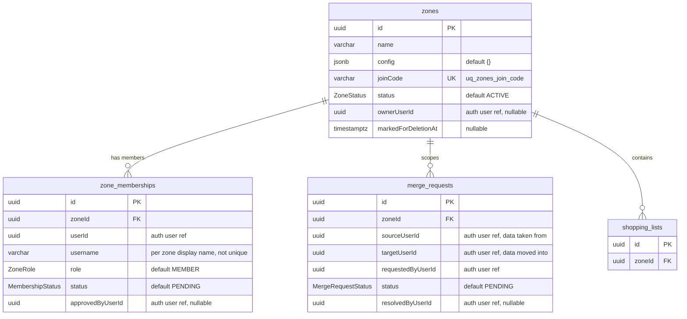
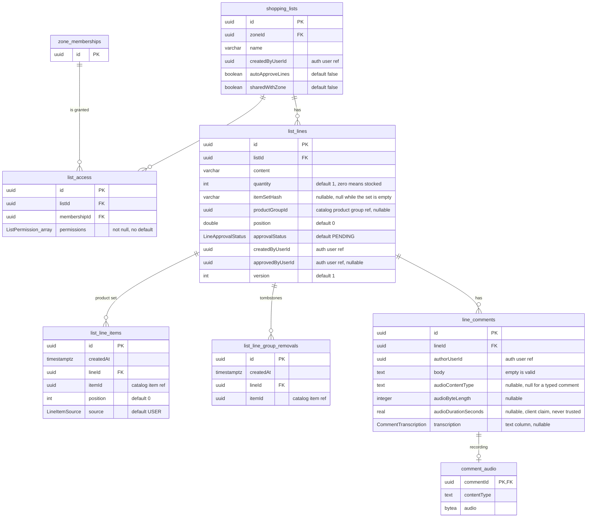
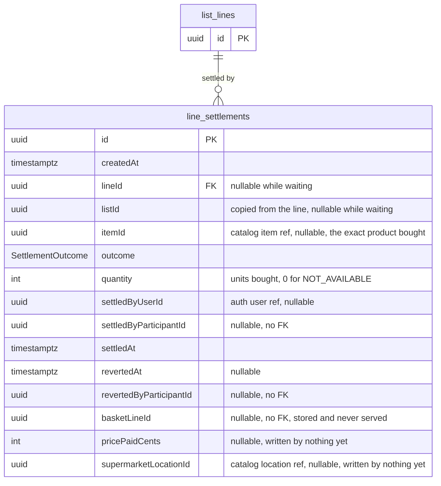
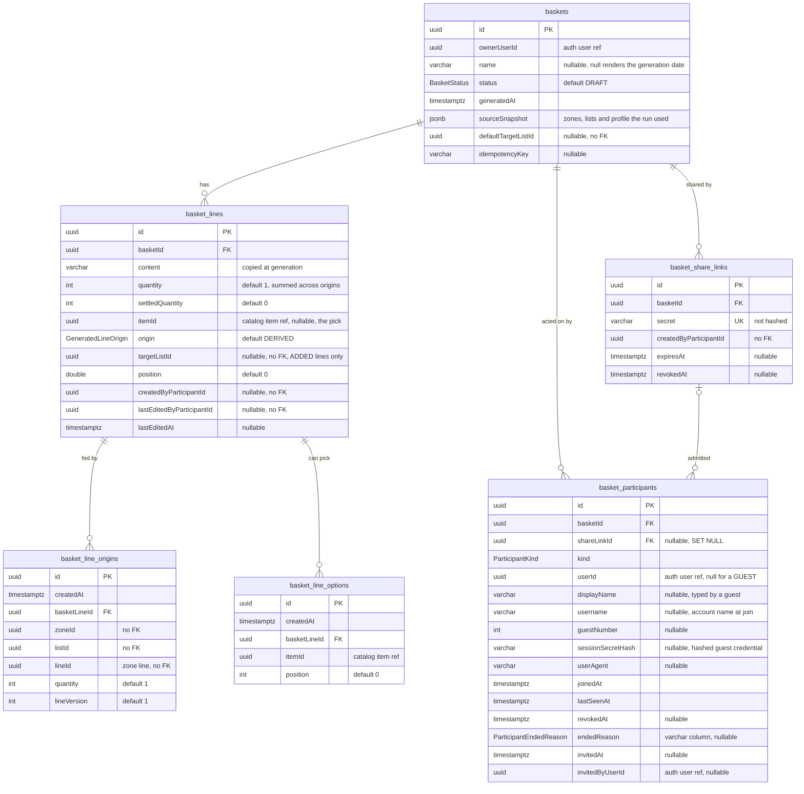
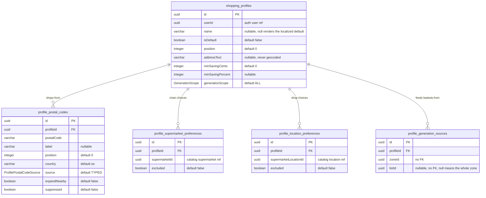
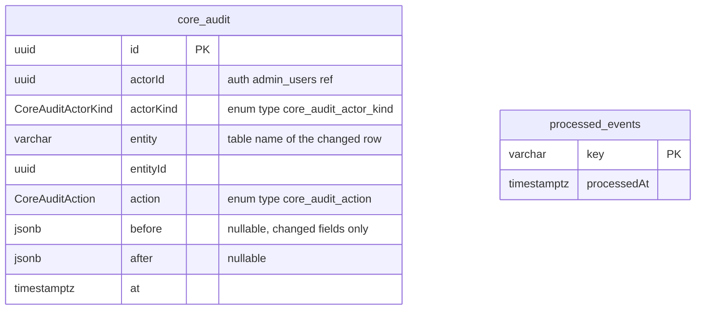

# Core service data model

Entity relationship diagrams for `luna-shopper-backend-core`: zones and membership, shopping lists
and their lines, settlements, generated baskets and their sharing, shopping profiles, and the
audit and inbox tables. This service owns its own Postgres database.

The source of truth is the TypeORM entities in `apps/luna-shopper-backend/core/src/app/entities`
and the migrations in `apps/luna-shopper-backend/core/src/app/db/migrations`. Where the two
disagree (a `DESC` index leg, a partial unique index, a check constraint, a foreign key with no
relation decorator), the migration is the schema of record. Update this file when either changes.

## Conventions

- Most tables extend `BaseEntity`: a `uuid` primary key `id` plus `createdAt` and `updatedAt`
  (`timestamptz`). The diagrams list those three columns only where a table does not extend it.
  Tables that are written once and never edited (`list_line_items`, `list_line_group_removals`,
  `line_settlements`, `basket_line_origins`, `basket_line_options`, `core_audit`)
  have no `updatedAt`. `comment_audio` and `processed_events` have no surrogate id.
- **Cross service ids are references, not foreign keys.** User ids (`userId`, `ownerUserId`,
  `createdByUserId` and the rest) come from auth. `core_audit.actorId` is an auth
  `admin_users.id`. Item, product group, supermarket and supermarket location ids come from
  catalog. Application code checks their shape. No database constraint can reach another
  service's database.
- A relationship drawn in a diagram is a real foreign key. Every one of them is `ON DELETE
  CASCADE`, except `basket_participants.shareLinkId`, which is `ON DELETE SET NULL`.
  A column the notes call a reference without a foreign key has no line in any diagram.
- Enum columns show the TypeScript enum name as their type. The values are in the
  [enum table](#enums). All of them live in `@portfolio/luna-shopper/contracts`, except the two
  `core_audit` enums, which live in the entity file.

## Zones and membership

- `zone_memberships` is unique on (`zoneId`, `userId`), so a user holds at most one membership per
  zone. `username` has a plain lookup index on (`zoneId`, `username`) and is not unique. It
  defaults from the global username at join time and is free to diverge afterwards (plan 0018).
  Two more indexes, (`zoneId`, `status`) and (`userId`, `status`), serve the member counts and
  the caller's own zone listing (plan 0017).
- `ownerUserId` is nullable because a zone can lose its owner. Deleting the owner sets
  `status = MARKED_FOR_DELETION` and `markedForDeletionAt`. An admin who claims ownership clears
  both. The zone reaper removes a zone whose marker is older than the grace period (plans 0006
  and 0011).
- A merge request moves one account's data into another inside one zone and kicks the source
  membership on approval. The accounts themselves stay, and other zones are untouched (plan 0008).

## Lists, lines and comments

- **Access is a set of permissions, not a role** (plan 0036). `list_access` is unique on
  (`listId`, `membershipId`). Every stored set contains `READ`, and an empty set is never stored:
  no access is no row. Zone `OWNER` and `ADMIN` members hold all four permissions on every list in
  their zone through `ZoneRole` at check time, and they have no row here.
- `sharedWithZone` makes a list open to every approved member of its zone, including members
  approved later (plan 0042). Turning it off revokes nobody. `autoApproveLines` decides only what
  a new line starts as (plan 0037). Both change with `MANAGE`. `shopping_lists` has an index on
  (`zoneId`, `updatedAt DESC`, `id`) for the zone preview.
- **A line has one state machine**, `approvalStatus`. The trip status column is gone (plan 0047):
  `quantity` is the state. Buying decrements it, zero means the household is stocked, and the line
  stays until somebody deletes it. What happened on a trip is a `line_settlements` row. `version`
  bumps on each edit for the last write wins reconciliation in plan 0009. The index on
  (`listId`, `quantity`) serves the total and wanted line counts.
- **The products a line stands for are a set in `list_line_items`** (plan 0048), unique on
  (`lineId`, `itemId`). The line has no `itemId` column. `itemSetHash` is a digest of the sorted
  distinct item ids, recomputed by the service on every write to the set (`item-set-hash.ts`), and
  it has a partial index where it is not null.
- **A line can subscribe to a catalog product group** (plan 0070). `productGroupId` names the group
  and has a partial index where it is not null. `list_line_items.source` records who put each
  product there: `GROUP` rows belong to the sync, and a `GROUP` row can become `USER` and never
  back. `list_line_group_removals` (unique on `lineId`, `itemId`) is a tombstone for a group
  product a person took off, so the next sync does not put it back. Only the sync reads it.
- A voice comment keeps its metadata on `line_comments`, so a comment listing never touches the
  bytes. `comment_audio` holds the recording as `bytea`, keyed one to one on the comment id, and
  only the playback route selects it (plan 0045). `audioContentType` being null is the test for a
  typed comment.

## Settlements

- One row is one line touched by one settling act (plan 0047). It is an append: a reopen sets
  `revertedAt` and `revertedByParticipantId` instead of deleting the row, and a reverted row drops
  out of every consumption total (plan 0054).
- Check constraints hold the shape:
  - `ck_line_settlements_actor`: exactly one of `settledByUserId` and `settledByParticipantId`.
    A settle from a shared basket is always attributed to the participant (plan 0051).
  - `ck_line_settlements_revert`: `revertedAt` and `revertedByParticipantId` are both null or both
    set.
  - `ck_line_settlements_home`: `lineId` and `listId` are both null or both set.
  - `ck_line_settlements_waiting_basket`: `lineId` or `basketLineId` is set.
- **A row with a null `lineId` is a waiting settlement** (plan 0093): a purchase on a basket line
  that has not reached a list yet. It belongs to the basket line through `basketLineId` and
  moves home when the line reaches a list.
- The participant ids carry no foreign key on purpose. A settlement is a zone fact, and deleting a
  basket or its participants leaves the purchase standing.
- Indexes: (`lineId`, `settledAt`), (`itemId`, `settledAt`), (`listId`, `settledAt`), and the
  partial `ix_settlements_waiting` on (`basketLineId`, `settledAt`) where `lineId` is null.

## Generated baskets and sharing

- **A basket is not a shopping list** (plan 0050). It draws from several zones at once, so it has
  no `zoneId`. Only its owner reads it, plus the participants that plan 0051 admits.
- A basket line copies text and quantity at generation time. It is not a live view of the zone
  lines. `basket_line_origins` (unique on `basketLineId`, `lineId`) records which
  zone lines fed it, what each contributed and the origin's `version` at the time. The zone ids in
  an origin carry no foreign key, so deleting a zone line never blocks on a basket.
- `basket_line_options` (unique on `basketLineId`, `itemId`) is the union of the
  origins' product sets, copied at generation. `itemId` on the line is the pick among them, and it
  is null for a free text line. Outstanding is `quantity - settledQuantity`.
- `idempotencyKey` has a partial unique index on (`ownerUserId`, `idempotencyKey`) where the key is
  not null, so a double tap returns the first basket instead of making two. Baskets are also
  indexed on (`ownerUserId`, `generatedAt`).
- **A link is an invitation, a participant is an identity** (plan 0051). A basket has zero live
  links or one: `uq_basket_share_links_live` is a partial unique index on
  `basketId` where `revokedAt` is null. Revoked links stay, so participants keep pointing at
  them. The link `secret` is stored in plain text so the owner can copy it again, and a guest's
  `sessionSecretHash` is hashed because it is a credential.
- Every actor on a basket is a participant, the owner included. Participant indexes: a partial
  unique index on (`basketId`, `userId`) where `userId` is not null, a partial unique index
  on `sessionSecretHash`, (`basketId`, `joinedAt`), `shareLinkId`, and
  (`userId`) where `userId` is not null and `revokedAt` is null for the shared baskets read
  (plan 0114).
- `endedReason` is set exactly when `revokedAt` is (`ck_basket_participants_ended`), and
  holds `REMOVED`, `LINK_REVOKED` or `LEFT` (`ck_basket_participants_ended_reason`).
  A live row with `invitedAt` set and a null `shareLinkId` is a member the owner added from their
  groups, and revoking a link does not reach it.

## Shopping profiles

- A profile is one way a person shops (plan 0049). `uq_shopping_profiles_default` is a partial
  unique index on `userId` where `isDefault`, so each user has exactly one default. Profiles are
  also indexed on `userId`.
- A postal code is stored as typed, never as the price scope it resolves to. Catalog resolves it
  per query (plan 0049). Unique on (`profileId`, `postalCode`). `NEARBY` rows are derived from a
  `TYPED` or `DEVICE` row with `expandNearby`, and removing one sets `suppressed` instead of
  deleting it (plan 0062).
- Chain and shop preferences are blacklists (plan 0064): no row means included. An excluded chain
  hides all its shops whatever their own rows say, and those rows stay so un excluding the chain
  restores them. Unique on (`profileId`, `supermarketId`) and (`profileId`,
  `supermarketLocationId`).
- Generation sources count only while `generationScope` is `SELECTED`, and they stay when it goes
  back to `ALL`. Uniqueness is two partial indexes: (`profileId`, `zoneId`, `listId`) where
  `listId` is not null, and (`profileId`, `zoneId`) where `listId` is null. A deleted zone or list
  leaves a stale source, which the generation run drops.

## Audit and event inbox

- `core_audit` records operator writes to core rows (plan 0077). It copies `catalog_audit`'s
  columns and lives in core's own database, because the audit row is written in the same
  transaction as the change. Core writes only `ADMIN` today. Nothing reads the table yet. Indexes:
  `at`, and (`entity`, `entityId`).
- `processed_events` is the inbox for idempotent event handling (plans 0004 and 0011). A handler
  records the key inside its transaction and skips the effect when the key is already there.

## Enums

| Enum                      | Values                                         |
| ------------------------- | ---------------------------------------------- |
| `ZoneStatus`              | `ACTIVE`, `MARKED_FOR_DELETION`                |
| `ZoneRole`                | `OWNER`, `ADMIN`, `MEMBER`                     |
| `MembershipStatus`        | `PENDING`, `APPROVED`, `KICKED`, `BANNED`      |
| `MergeRequestStatus`      | `PENDING`, `APPROVED`, `REJECTED`, `CANCELLED` |
| `ListPermission`          | `READ`, `WRITE`, `DECIDE`, `MANAGE`            |
| `LineApprovalStatus`      | `PENDING`, `APPROVED`, `REJECTED`              |
| `LineItemSource`          | `GROUP`, `USER`                                |
| `CommentTranscription`    | `PENDING`, `READY`, `FAILED`, `UNAVAILABLE`    |
| `SettlementOutcome`       | `BOUGHT`, `NOT_AVAILABLE`                      |
| `BasketStatus`     | `DRAFT`, `ACTIVE`, `COMPLETED`, `ARCHIVED`     |
| `GeneratedLineOrigin`     | `DERIVED`, `ADDED`                             |
| `ParticipantKind`         | `OWNER`, `REGISTERED`, `GUEST`                 |
| `ParticipantEndedReason`  | `REMOVED`, `LINK_REVOKED`, `LEFT`              |
| `GenerationScope`         | `ALL`, `SELECTED`                              |
| `ProfilePostalCodeSource` | `TYPED`, `DEVICE`, `NEARBY`                    |
| `CoreAuditActorKind`      | `ADMIN`, `SERVICE`                             |
| `CoreAuditAction`         | `CREATE`, `UPDATE`, `DELETE`                   |

## Catalog

Catalog owns its own schema in its own database, in the catalog service. Its entities are in
`apps/luna-shopper-backend/catalog/src/app/entities`, and this file does not draw them.
