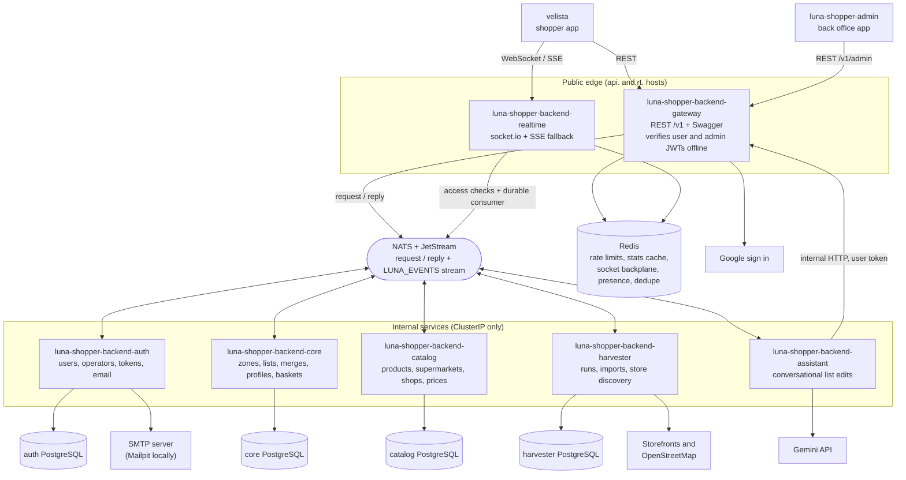
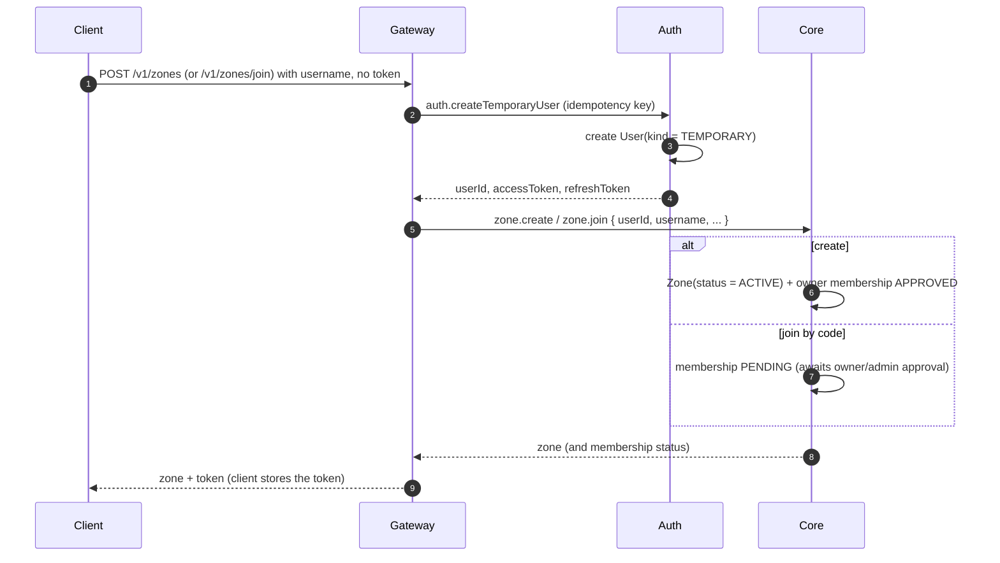

# System architecture

System level diagrams for the Luna Shopper backend, kept with the gateway because it is the
public entry point. Seven NestJS services make up the backend: `gateway`, `realtime`, `auth`,
`core`, `catalog`, `harvester` and `assistant`. Four of them own a private PostgreSQL database
(auth, core, catalog and harvester). The gateway, the realtime service and the assistant own
none. The per service data models live in `apps/luna-shopper-backend/auth/docs/data-model.md`
and `apps/luna-shopper-backend/core/docs/data-model.md`. Source of truth is the plan set under
`apps/luna-shopper-backend/plans/`.

## Component diagram

Auth signs two kinds of access token with two separate asymmetric key pairs: one for users and
one for back office operators. The gateway holds both public keys and the realtime service holds
the user public key. Both verify tokens offline, so no request needs a synchronous call to auth.
An admin route accepts only an operator token, and a user route accepts only a user token.

Services never call each other directly across a boundary. Every exchange goes over the broker,
as a request with a reply or as a published event. The one exception is the assistant: it acts
through the gateway's own HTTP routes with the caller's token, so it can read and write only what
that person can.

## Who talks to whom

- **Two clients.** Velista is the shopper app. It calls the gateway for every read and write and
  holds a socket to the realtime service for live updates. The back office app
  (`apps/luna-shopper-admin`) calls only the gateway, under `/v1/admin/...`, with an operator
  token checked by the gateway's admin JWT guard.
- **Two public services.** The gateway and the realtime service are the only services with an
  HTTPRoute (`routed: true` in `k8s/helm/values.yaml`, hosts `api.` and `rt.`). The other five are
  ClusterIP services with no route.
- **The gateway** translates each HTTP route into a broker request to the service that owns the
  data. It owns no domain logic and no database. Redis holds its rate limit counters and the
  public stats cache.
- **The realtime service** reads the `LUNA_EVENTS` JetStream stream through a durable consumer.
  Before a socket joins a zone or list room, it asks core over the broker for permission. It then
  pushes each event to the rooms it belongs to. Redis carries the socket.io adapter channels,
  presence and the redelivery dedupe window. That shared state is what makes more than one
  replica correct.
- **Auth** owns users, operator accounts and token issuing. It sends account email over SMTP
  (Mailpit in the local compose stack) and publishes identity events.
- **Core** owns zones, memberships, lists, lines, comments, merges, shopping profiles and baskets
  (baskets). It asks catalog over the broker for postal code lookups and publishes the
  domain events the realtime service fans out.
- **Catalog** owns products, brands, supermarkets, shops, price scopes and every stored price. It
  publishes catalog events on the broker.
- **The harvester** fetches prices and shop lists from supermarket storefronts, finds shops on
  OpenStreetMap and reads uploaded leaflet documents. It writes what it finds into catalog over the
  broker, never into catalog's database. Operators control it through the gateway's
  `/v1/admin/harvest/...` routes. It also has its own background worker, for the postal code
  queue.
- **The assistant** owns no database. The gateway forwards `/v1/assistant` turns to it over the
  broker. It calls the Gemini API for the model and acts through the gateway's internal URL. With
  no `GEMINI_API_KEY` it stays healthy and answers 501.

## Sequence: start a space or join by code (token handshake)

A client with no token gets one only by creating or joining a zone. A temporary user is minted at
that moment and never before.

## Sequence: realtime propagation of a change

Domain services never hold sockets. They publish events to JetStream, and the realtime service
fans them out to the authorized rooms.

## The published API contract

`openapi.json` in this directory is the generated, committed description of the gateway's public
HTTP surface (plan 0019). It is not written by hand. Every response schema in it is the same JSON
Schema from `libs/luna-shopper/contracts/src/schemas` that the services validate their broker
messages against, projected into OpenAPI 3.1 by the bridge in `gateway/src/app/docs/`. Request
shapes come from the DTO classes, and error bodies come from one composite decorator driven by
the platform's `ERROR_STATUS`.

- Regenerate it with `npx nx run luna-shopper-backend-gateway:openapi` and commit the diff. A
  response shape therefore shows up as a reviewable change in the pull request that causes it.
- The gateway's unit tests fail when the file is stale, so a forgotten regeneration cannot merge.
  They also fail when a controller is added without a documented response.
- The end to end suite validates real responses against this file, which is what makes it a
  promise rather than a description.
- The back office reads its types out of this document
  (`npx nx run luna-shopper-admin/models:wire-types`), so a change here is two regenerations.
- A client can vendor or fetch a versioned copy without a running backend. Velista still maps
  every response from `unknown` into its own models (rule D4). The published schema makes that
  mapping verifiable. It does not make the backend's shape safe to pass around.

## Notes

- All public routes are URL versioned by major version, per controller independently
  (`/v1/...`), and documented in Swagger on the gateway (plan 0004). Swagger is served at `/docs`
  from the very same document `openapi.json` is generated from.
- Event names, message patterns and room prefixes are shared through
  `@portfolio/luna-shopper/contracts`.
- Every service except the harvester runs two replicas. The harvester runs one with a `Recreate`
  strategy, because a run holds in memory state, and it exists in a cluster only when
  `lunaShopperBackend.harvester.enabled` is true.
