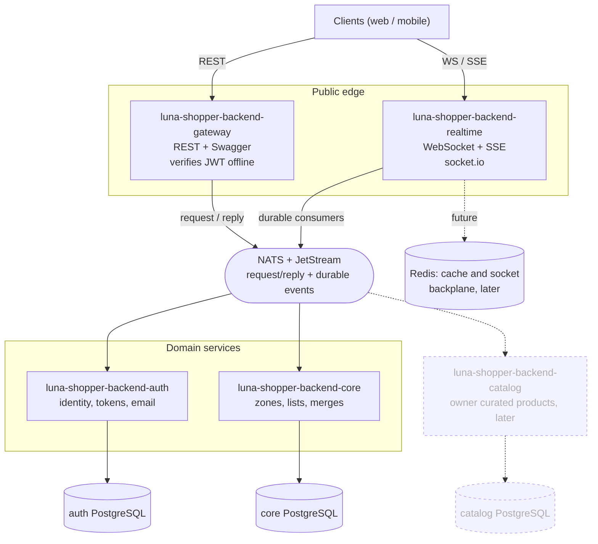
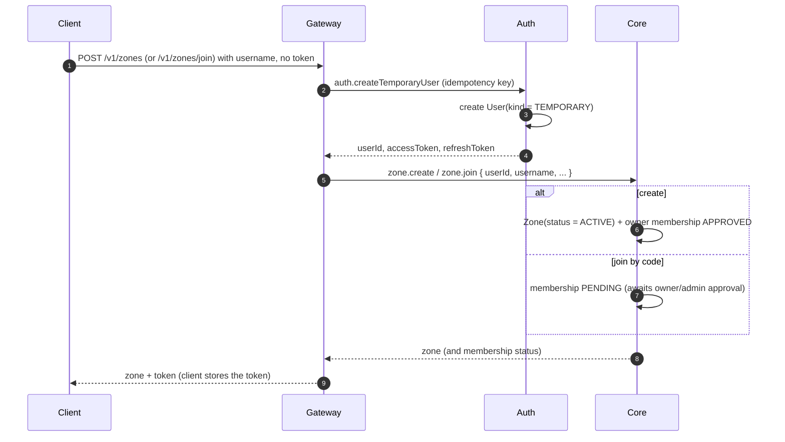
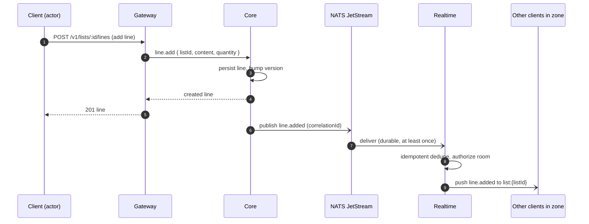

# System architecture

System level diagrams for the Luna Shopper backend, kept with the gateway because it is the
public entry point. The gateway and the realtime service own no database; the per service data
models live in `apps/luna-shopper-backend/auth/docs/data-model.md` and
`apps/luna-shopper-backend/core/docs/data-model.md`. Source of truth is the plan set under
`apps/luna-shopper-backend/plans/`.

## Component diagram

Auth signs access tokens with an asymmetric key; the gateway and realtime hold only the public
key and verify tokens offline, so no request needs a synchronous call to auth. Every service is
independently deployable and speaks only the broker across boundaries, which keeps the backend
polyglot ready (a future service may be .NET or Spring).

## Sequence: start a space or join by code (token handshake)

A client with no token gets one only by creating or joining a zone; a temporary user is minted at
that moment and never before.

## Sequence: realtime propagation of a change

Domain services never hold sockets. They publish events to JetStream, and the realtime service
fans them out to the authorized rooms.

## The published API contract

`openapi.json` in this directory is the generated, committed description of the gateway's public
HTTP surface (plan 0019). It is not written by hand: every response schema in it is the same JSON
Schema from `libs/luna-shopper/contracts/src/schemas` that the services validate their broker
messages against, projected into OpenAPI 3.1 by the bridge in
`gateway/src/app/docs/`. Request shapes come from the DTO classes, error bodies from one
composite decorator driven by the platform's `ERROR_STATUS`.

- Regenerate it with `npx nx run luna-shopper-backend-gateway:openapi` and commit the diff. A
  response shape therefore shows up as a reviewable change in the pull request that causes it.
- The gateway's unit tests fail when the file is stale, so a forgotten regeneration cannot merge,
  and they fail when a controller is added without a documented response.
- The end to end suite validates real responses against this file, which is what makes it a
  promise rather than a description.
- A client can vendor or fetch a versioned copy without a running backend. Velista still maps
  every response from `unknown` into its own models (rule D4); the published schema makes that
  mapping verifiable, it does not make the backend's shape safe to pass around.

## Notes

- All public routes are URL versioned by major version, per controller independently
  (`/v1/...`), and documented in Swagger on the gateway (plan 0004), served at `/docs` from the
  very same document `openapi.json` is generated from.
- Event names and room prefixes are enums shared through `@portfolio/luna-shopper/contracts`.
- Redis and the catalog service are drawn dashed because they are planned for later phases, not
  part of the current build.
