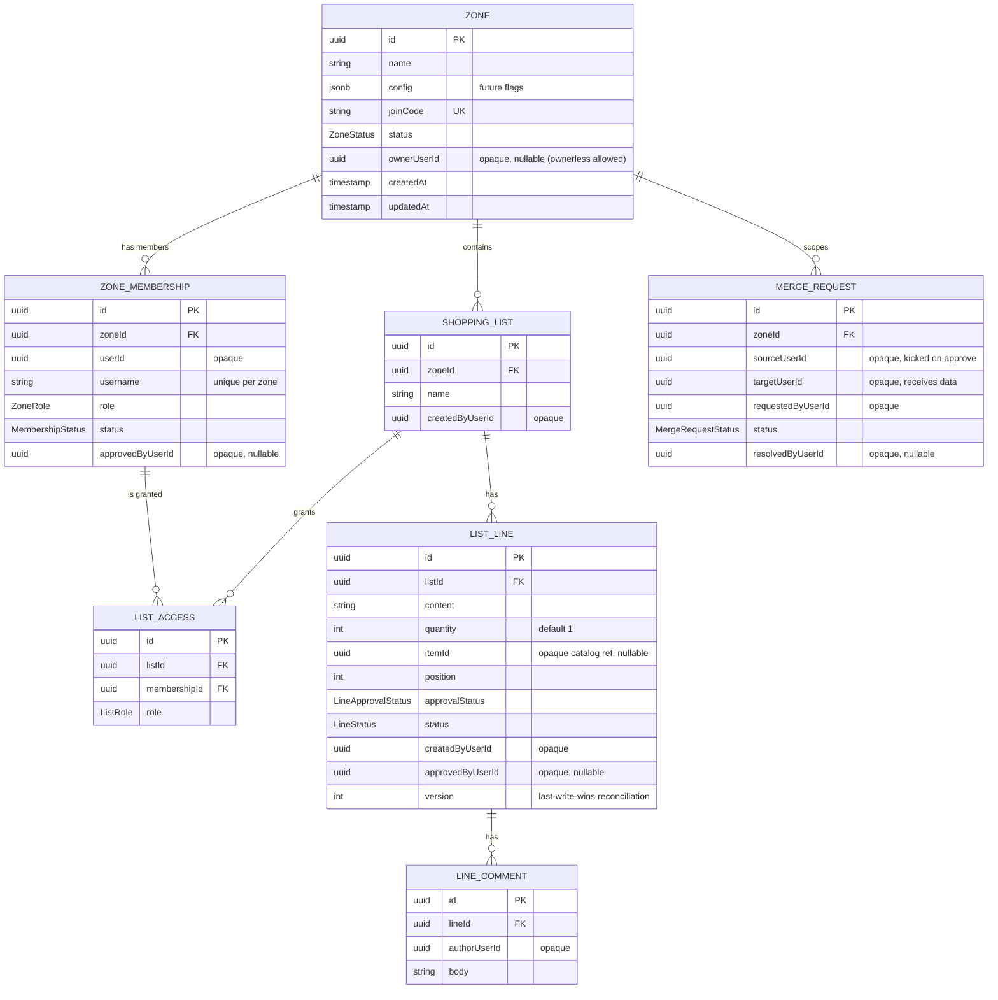
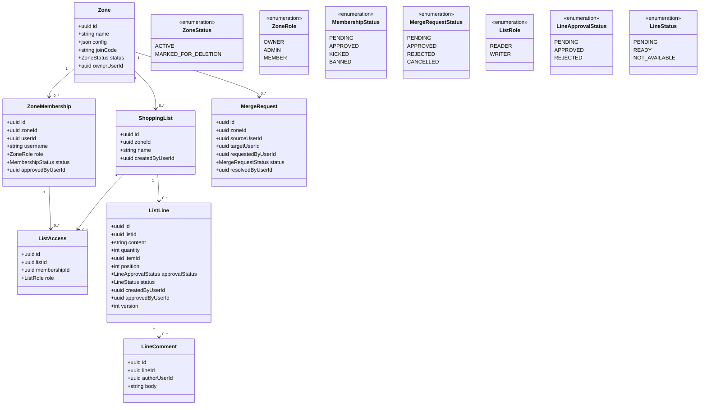
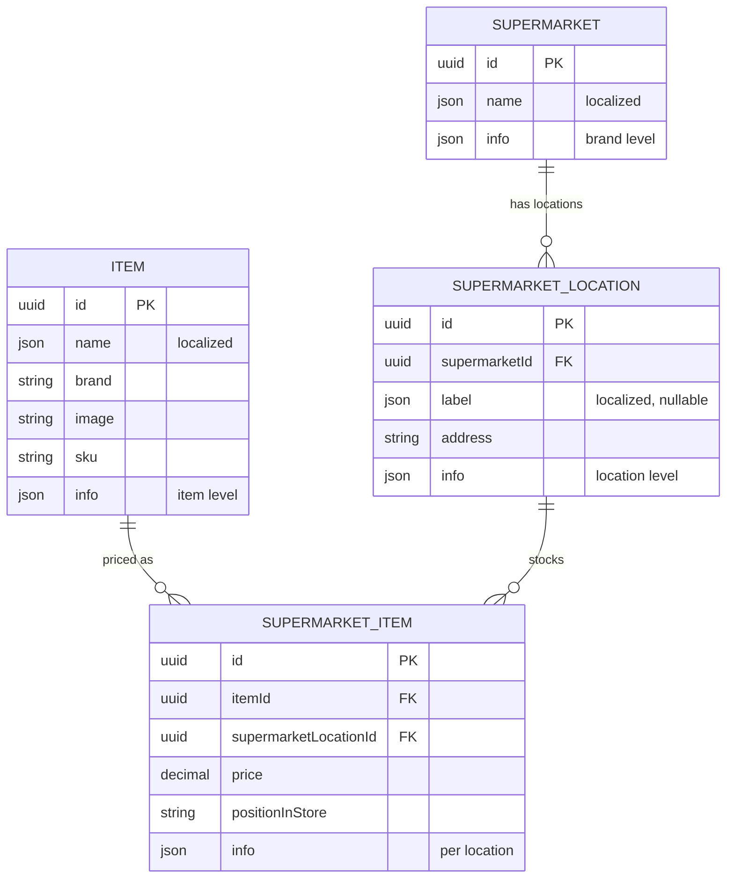

# Core service data model

Entity relationship and class diagrams for `luna-shopper-core`: zones, membership, merges, and
shopping lists. This service owns its own database. Source of truth for the model is the plans
`0006-zones-and-membership.md`, `0007-shopping-lists.md`, and `0008-account-merge.md`; these
diagrams are generated from them and should be updated alongside the entities once coded.

Users are referenced only by an opaque `userId` minted by the auth service. Core never reads the
auth database, so those references are plain columns, not foreign keys. Likewise `ListLine.itemId`
is an opaque reference into the future catalog service (see the appendix), also not a foreign key.

## ER diagram (core database)

Constraints of note: `ZONE_MEMBERSHIP` is unique on (`zoneId`, `userId`) and on (`zoneId`,
`username`); `LIST_ACCESS` is unique on (`listId`, `membershipId`).

## Class diagram

## Notes

- A line carries two independent state machines: `approvalStatus` (it must be approved) and
  `status` (the item state: pending, ready, not available). The `version` column backs the last
  write wins reconciliation used by realtime (plan 0009).
- `ownerUserId` is nullable: a zone can be temporarily ownerless (owner account deleted), which
  sets `status = MARKED_FOR_DELETION` until an admin claims ownership or a reaper removes it
  (plans 0006 and 0011).
- Cross service references (`ownerUserId`, `userId`, `createdByUserId`, and the merge user ids)
  point at auth `User.id`; `itemId` points at catalog `Item.id`. They are validated in
  application code, never by a database foreign key, because each service owns its own database.

## Appendix: catalog service (planned, separate database)

The catalog is its own service (`luna-shopper-catalog`, plan 0012) with its own database, built
last and owner curated. It is shown here because `ListLine.itemId` optionally references it. When
the catalog app is scaffolded this diagram moves to `apps/luna-shopper/catalog/docs/`.

`SUPERMARKET` is the chain (Mercadona is one row); `SUPERMARKET_LOCATION` is each physical store
(50 rows for 50 Mercadonas); `SUPERMARKET_ITEM` is the per store price and position for an item,
unique on (`itemId`, `supermarketLocationId`).
